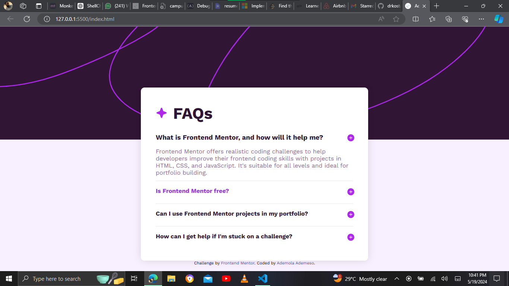

# Frontend Mentor - FAQ accordion solution

This is a solution to the [FAQ accordion challenge on Frontend Mentor](https://www.frontendmentor.io/challenges/faq-accordion-wyfFdeBwBz). 

## Table of contents

- [Overview](#overview)
  - [The challenge](#the-challenge)
  - [Screenshot](#screenshot)
  - [Links](#links)
- [My process](#my-process)
  - [Built with](#built-with)
  - [Continued development](#continued-development)
- [Author](#author)

## Overview

### The challenge

Users should be able to:

- Hide/Show the answer to a question when the question is clicked
- Navigate the questions and hide/show answers using keyboard navigation alone
- View the optimal layout for the interface depending on their device's screen size
- See hover and focus states for all interactive elements on the page

### Screenshot

### Links

- Solution URL: [Solution URL](https://www.frontendmentor.io/solutions/responsive-faq-accordion-using-javascript-JLIWbTpHE1)
- Live Site URL: [Live Site](https://ademolaademeso-faq-akrdn.vercel.app/)

## My process

### Built with

- Semantic HTML5 markup
- CSS custom properties
- Mobile-first workflow
- JavaScript styling

### Continued development

Responsive screen sizes.

## Author

- Website - [Ademola Ademeso](https://ademolaademeso.vercel.app)
- Frontend Mentor - [@KingDez04](https://www.frontendmentor.io/profile/KingDez04)
- Twitter - [@King_dez_04](https://twitter.com/King_dez_04)
